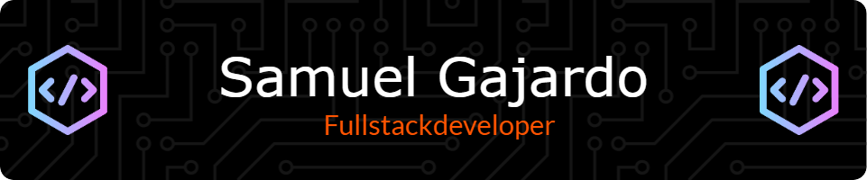

# 👋 Hi! I'm Samuel Gajardo

I'm an **Informatics Engineer** with a passion for application development, database management, and web development. Always eager to learn new technologies.

---

# 

- 🎓 **Education**: Informatics Engineering from Inacap (2021-2024)
- 🌱 **Currently learning**: Data analysis and machine learning.
- 🔧 **Skills**: JavaScript, React, Node.js, Firebase, Python.
- 💼 **Experience**: Developed the **Montino** app for a local small business.
- 🌍 **Location**: Santiago, Chile

## 🚀 Featured Projects

### 📦 **Montino App**
A desktop application for inventory and sales management in a minimarket.

## 📈 GitHub Stats

## 📫 Contact
- 📧 Email: s.g.g.j.2003@gmail.com
- 🌐 [My Portfolio](https://mi-portafolio-git-main-samus-projects-9f65b7a9.vercel.app//)
- 💼 [LinkedIn](https://www.linkedin.com/in/samuel-gajardos/)

---

### 🧑‍💻 Technologies & Tools

---

